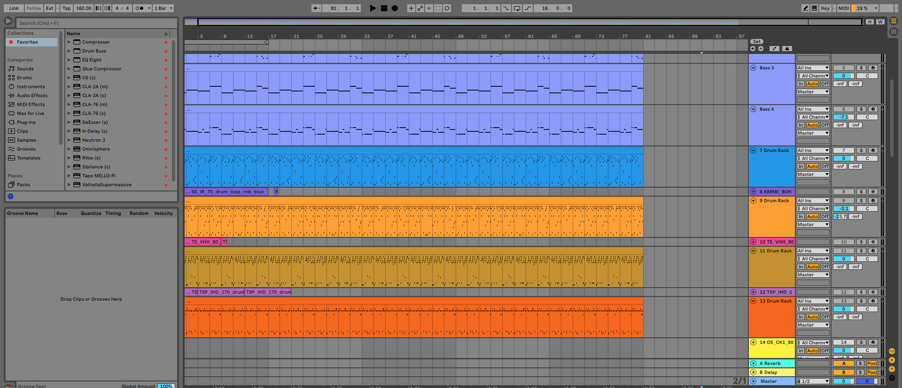

**Living Score** is an interactive audiovisual piece built with p5.js, p5.sound, and MIDI timing data. Audio layers and moving visuals are tightly linked: note events shape the visuals, and moving objects also reshape the audio mix.

## Project Direction

Our team created a responsive audiovisual system where sound and graphics are connected through timing, motion, and interaction. The sketch uses tracked audio layers, MIDI event timing, FFT, and moving controllers so the piece feels like a living score.

### Team Vision

Living Score aims to be a two-way audiovisual ecosystem. Music timing drives the visuals, while moving elements also reshape the mix by switching tracks, muting layers, and triggering synth events.

### Inspiration Sources

- Patt Vira — *Rainbow Pendulum Waves*: repeated moving objects and rhythmic motion.
- Patt Vira — *Musical Onion*: assigning musical meaning to visual structures.
- Abstract audio visualisers: circles, pulses, textures, and colour reacting to sound.

## Mechanics

| Team Member | Mechanic |
|---|---|
| Jake | Audio / music output system |
| Hayley | Random animation |
| Merna | Background visual |
| Zach | Visual control of audio effects |

### Mechanic 1: Audio / Music Output System  
**Owner: Jake**

The project uses multiple audio layers, including bass, drums, guitar, strings, synth textures and vocals, which are loaded as separate files and controlled through a central playback system. The bass, drum and string sections each use matching MIDI files to detect when notes or hits occur, allowing the visuals to react to real musical timing rather than random animation. The guitar also uses MIDI timing to create visual responses to individual notes.
The synth and whole-track FFT systems analyse the frequency content of the music, including spectrum, centroid and energy across different frequency bands. These values help drive larger visual changes such as background movement, intensity and texture. The vocal system adds another layer by using pitch detection to track vocal frequency and note names, allowing the visual system to respond to melodic vocal information as well.
All of these systems are coordinated by musicbrain.js, which manages loading, setup, play/pause control, MIDI hit checking, FFT updating and communication with the final visual layer. This makes the final work a synchronised audio-visual system where sound structure directly shapes what happens on screen.

this included making the music for the track and designing it in away that can change 4 different bass lines, drum pattern and strings sections. As well as changing vocals lines made it challenging song to compose.

### Mechanic 2: Random Animation  
**Owner: Hayley**

The switch-visual layer renders each bouncing object so that its appearance is in constant motion and responds to the activity of the track it represents. Every object itself now has a continuous, time-based motion compared to just adding a static shape. Their size will gently pulse, rotate slowly and give off a glow fading in and out. Such adds a lively view to the scene and evolves quality between events and the per-object phase introduced will keep the object pulsing and spinning in lockstep. 

The particle details are added based on the set of small spark points for object orbits. They circle calmly during steady playbacks and double when an event-driven burst occurs. For example, when an object registers for a hit, the sparks will accelerate, brighten and grow, pushing outward before another animation happens, impacting with a higher energy. 

The layer responding to the note and track events through the hit signal passed in from the logic layer (bouncer.flash), which spikes whenever an object is struck. The signal drives a size pop, spin kick, spark burst and expanding in a coloured ring format, so that each event is performed as a type of visual energy that naturally decays. The strength of response is tied to the type of sound, where drum and bass react the hardest, guitar reacts moderately and vocal and synth stay deliberately subtle so that the intensity of the motion and particles scales according to their role and the energy of each part instead of reacting identically. 

The colour and detail also evolve with the track state, where each instrument has a distinct and evenly spaced colour so that they can be easily distinguished. With the track being muted, the function being added as well, the shape, glow and shockwave of the object will dim roughly half of its original brightness, giving off an immediate visual cue of change. 

These changes work towards the goal of motion, particles, and evolving visual detail which responds to audio energy and note events. The time-based motion keeps the visuals alive and the sparks act as the particle layer where the event-driven reactions will transform the note events and relative energy of each part into a proportional visual response. The audio-energy is performed in the logic layer and added to this file according to the state of each object which turns the layer into on-screen motion and detail. 

### Mechanic 3: Background Visual  
**Owner: Merna**

Generates reactive background visuals that respond to the music system.

The background uses:
- Bass MIDI hits
- Drum MIDI hits
- Guitar MIDI hits
- Strings MIDI hits
- Synth FFT energy analysis
- Vocal pitch detection

Visual effects include:
- Expanding ripple animations
- Reactive particle systems
- Aurora-style background waves
- Orbiting visual objects
- Dynamic colour transitions
- Audio-responsive motion and texture changes

The goal is to make the background respond directly to audio events rather than operate as an independent animation layer.

### Mechanic 4: Visual Control of Audio Effects  
**Owner: Zach**

Uses bouncing objects as controllers that mute/unmute layers, switch tracks, control audio effects, and trigger synth notes based on collisions.

## Part 3: Putting It Together

The final piece combines audio playback, MIDI-driven visual triggers, and interactive motion. Audio events feed the main visual system, while bouncing controllers feed the mix. This keeps the work coherent and responsive.

## How it works

- `musicbrain.js` is the central controller. It loads audio and MIDI data, sets up the canvas, updates FFT and MIDI triggers, and draws the final visuals.
- Each instrument layer uses a separate audio file and MIDI track for accurate timing: bass, drums, guitar, strings, synth, and vocals.
- The main visual layer is rendered by `full.js`, which receives MIDI hit events and turns them into colour, motion, and textural effects.
- The mix is controlled by bouncing objects in `switchlogic.js`. These objects move inside a resizable zone, and hitting different walls switches tracks, toggles mute, or triggers synth notes.
- Instrument pan and reverb are mapped from object position, making spatial movement part of the audio control.

## Techniques

- `preload()`, `setup()`, and `draw()` provide the p5.js sketch lifecycle.
- `loadSound()` and `p5.Sound` manage audio layers, playback, pause, pan, reverb, and FFT analysis.
- `userStartAudio()` is used in `mousePressed()` so audio can start reliably in the browser.
- `Tone.js` MIDI parsing supplies precise event timing for visual hits and sync across audio tracks.
- `map()`, `constrain()`, and `dist()` translate visual object positions into audio parameters like pan and reverb amount.
- `mousePressed()` toggles play/pause and handles clicks on the bouncing controls.
- `mouseDragged()` lets the user resize the bouncing zone with a bottom slider.
- The `WallSwitchBouncer` class manages object motion, wall collisions, and safe audio actions without crashing the sketch.

### Key design decisions

- Use separate audio and MIDI layers so notes can trigger visuals without relying only on FFT.
- Keep play/pause simple with a click or spacebar, while the bouncing objects handle the performance controls.
- Make track switching physical: wall collisions choose bass and drum variations, guitar mute/unmute, and vocal routing.
- Add synth spheres as optional moving controllers so users can change the sound while watching the visual system.

## Interaction Instructions

- Click anywhere on the canvas to start or pause the audio.
- Press the spacebar as a backup play/pause control.
- Click a bouncing instrument object to mute or unmute that layer.
- Drag the slider at the bottom to change the size of the bounce zone.
- Click `ADD SYNTH NOTES` to add moving synth spheres, and `REMOVE SYNTH NOTES` to remove them.
- Watch the bouncing objects hit walls: each wall triggers a different audio action.
- Use left/right position for pan control, and moving farther from the center increases reverb.

---

## Notes

- The project runs best in a browser that supports Web Audio.
- The visuals and audio are designed to work together: audio events feed the animation, and object movement feeds the mix.

