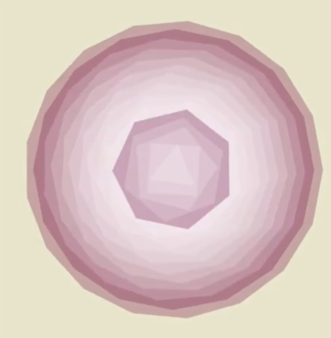
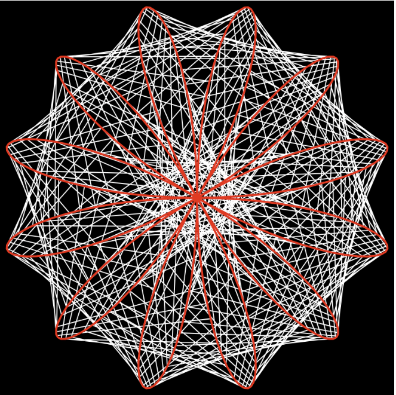

# IDEA9103 Final Assessment Project Pitch  
## Working Title: **Living Score**

---

## Part 1: Project Direction

Our team has chosen to create an **original interactive audiovisual piece**.

### Team Vision

**Living Score** is an interactive audiovisual artwork where sound and visuals continuously influence one another. Unlike traditional music visualisers that only react to audio, our system creates a two‑way relationship: music shapes the visuals, and the visuals can also reshape the music. We combine a WAV track with multiple MIDI files to detect precise musical events like drum hits, piano notes, guitar lines, and bass patterns. These events trigger visual changes, while selected visual elements can mute, switch, or adjust musical layers in real time.

Our inspirations include Patt Vira’s *Rainbow Pendulum Waves* and *Musical Onion*, which connect rhythm, colour, and motion through generative design. We also draw from abstract audio visualisers that use geometric figures, pulses, waves, and particles to express musical energy. Our goal is to build a living system where timing, randomness, sound, visuals, and user interaction feel tightly connected through an artwork that behaves like a responsive ecosystem rather than a one‑way animation.

---

### Inspiration Sources

#### Inspiration 1: Patt Vira - *Rainbow Pendulum Waves*
This project inspired our use of repeated animated objects, rhythmic timing, and musical note values connected to visual movement.

#### Inspiration 2: Patt Vira - *Musical Onion*
This project inspired the idea of assigning musical meaning to visual objects, making the artwork feel structured but playful.

#### Inspiration 3: Abstract Audio Visualisers
We are also inspired by abstract visualisers that use circles, waves, pulses, and colour changes to represent musical energy.

---

## Part 2: Mechanics

### Team Members and Mechanics

| Team Member | Mechanic |
|---|---|
| Jake | Audio / music output system |
| Hayley | Random animation |
| Merna | Background visual |
| Zach | Visual control of audio effects |

---

### Mechanic 1: Audio / Music Output System  
**Owner: Jake**

This system forms the musical foundation of *Living Score*. A single WAV file provides the main audio, while multiple MIDI files supply precise timing data for kicks, snares, hi‑hats, piano notes, guitar lines, and bass events. MIDI allows us to detect both individual hits and overlapping notes without relying solely on FFT analysis. Visual elements can also influence the audio by muting, switching, or adjusting specific layers. FFT of the final output adds another layer of responsiveness, allowing colour, movement, and atmosphere to react to the full mix. This mechanic acts as the project’s “music brain,” coordinating all audiovisual interactions.

---

### Mechanic 2: Random Animation  
**Owner: Hayley**

This mechanic introduces unpredictable motion through particles, circles, lines, and other small visual elements. Random values determine their position, size, colour, speed, and direction, ensuring the canvas always feels alive and evolving. Although their behaviour is random, these elements still respond to musical cues that expands on kick hits, shifting direction on snares, or changing colour during melodic events. This balance of randomness and musical structure prevents the visuals from feeling chaotic or disconnected. The result is a constantly shifting layer of motion that enriches the artwork’s energy and keeps the viewer engaged throughout the experience.

---

### Mechanic 3: Background Visual  
**Owner: Merna**

The background visual sets the overall mood and atmosphere of *Living Score*. Instead of a static colour, it uses gradients, waves, particles, and Perlin‑noise‑based textures that move organically across the canvas. Low‑frequency energy creates slow pulses, while higher frequencies generate sharper flickers and bright accents. The background also shifts depending on which musical layers are active like drums, bass, piano, or guitar, which allows the environment to evolve with the music. This mechanic ties the entire piece together, providing a cohesive visual foundation that feels natural, smooth, and emotionally expressive.

---

### Mechanic 4: Visual Control of Audio Effects  
**Owner: Zach**

This mechanic enables visuals to directly influence the music, completing the two‑way interaction at the heart of *Living Score*. Certain shapes act as “visual controllers” that can mute layers, adjust volume, switch instruments, or trigger audio effects as they move or collide with zones on the canvas. User input from the mouse or keyboard can also manipulate these controllers, making the artwork interactive and performative. Implementing this relies on JavaScript concepts such as classes, collision detection, mapping values, and event handling. Together, these visual controllers allow the artwork to reshape its own soundtrack in real time, making the system feel alive and responsive.

---

## Part 3: Putting It Together

The final piece will work as a connected audiovisual system. The WAV file will provide the main sound, while MIDI data will create accurate musical triggers. Random animation and background visuals will respond to these musical outputs, while some visual elements will also control the audio by changing volume, muting, or switching parts. FFT analysis of the final sound output will add another layer of response, allowing the visuals to react to the sound after it has been shaped by the artwork. This creates one coherent piece where music and visuals influence each other.

---
